# Граф зависимостей проекта Baccarat

> Визуальное представление зависимостей между модулями и классами

## 📊 Общая архитектура (высокий уровень)

```mermaid
graph TB
    GameController[GameController<br/>Главный координатор]
    
    subgraph "Игровой процесс"
        GamePhaseManager[GamePhaseManager]
        BaccaratRules[BaccaratRules]
        HandManager[HandManager]
        CardDealer[CardDealer]
    end
    
    subgraph "UI система"
        UIManager[UIManager]
        CardUIManager[CardUIManager]
        ButtonUIManager[ButtonUIManager]
        ToggleUIManager[ToggleUIManager]
    end
    
    subgraph "Система выплат"
        PayoutQueueManager[PayoutQueueManager]
        PayoutManager[PayoutManager]
        PayoutCalculator[PayoutCalculator]
        PayoutValidator[PayoutValidator]
    end
    
    subgraph "Система фишек"
        ChipVisualManager[ChipVisualManager]
        ChipStackManager[ChipStackManager]
    end
    
    subgraph "EventBus"
        EventBus[EventBus<br/>38+ сигналов]
    end
    
    subgraph "Утилиты (Phase 8-10)"
        PayoutReturnHandler[PayoutReturnHandler]
        PayoutPreparationHandler[PayoutPreparationHandler]
        UIEventHandler[UIEventHandler]
        InputHandler[InputHandler]
        CameraNavigationController[CameraNavigationController]
        ChipNavigationCoordinator[ChipNavigationCoordinator]
        CollectionModeHandler[CollectionModeHandler]
        KeyboardFocusHandler[KeyboardFocusHandler]
        GamepadMonitor[GamepadMonitor]
        RoundsCounterUpdater[RoundsCounterUpdater]
    end
    
    GameController --> GamePhaseManager
    GameController --> UIManager
    GameController --> PayoutQueueManager
    GameController --> ChipVisualManager
    GameController --> PayoutReturnHandler
    GameController --> PayoutPreparationHandler
    GameController --> UIEventHandler
    GameController --> InputHandler
    GameController --> CameraNavigationController
    
    GamePhaseManager --> BaccaratRules
    GamePhaseManager --> HandManager
    GamePhaseManager --> CardDealer
    GamePhaseManager --> EventBus
    
    UIManager --> CardUIManager
    UIManager --> ButtonUIManager
    UIManager --> ToggleUIManager
    
    PayoutQueueManager --> PayoutManager
    PayoutManager --> PayoutCalculator
    PayoutManager --> PayoutValidator
    
    PayoutValidator --> ChipStackManager
    
    GameController -.-> EventBus
    GamePhaseManager -.-> EventBus
    PayoutQueueManager -.-> EventBus
    ChipVisualManager -.-> EventBus
```

## 🔄 Поток данных в игровом процессе

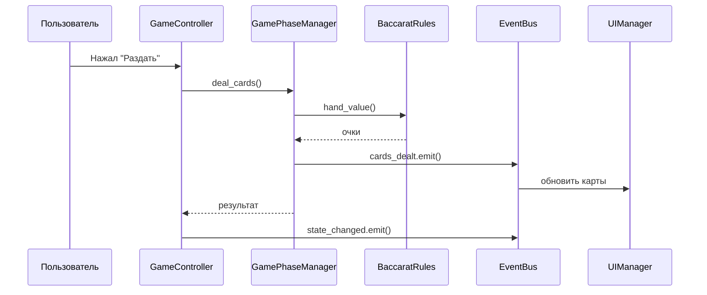

## 🎯 Система выплат (детально)

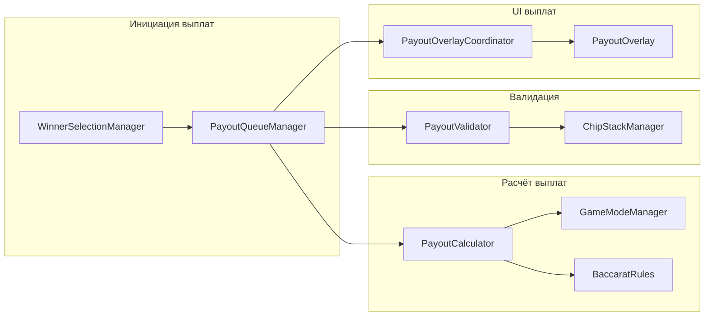

## 🎨 UI система (Phase 2 рефакторинг)

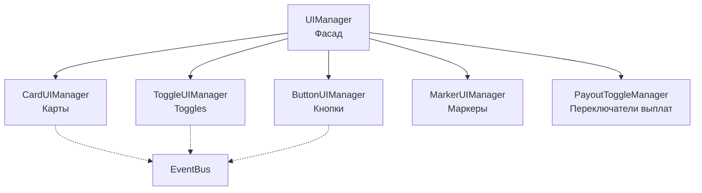

## 👥 Система гостей

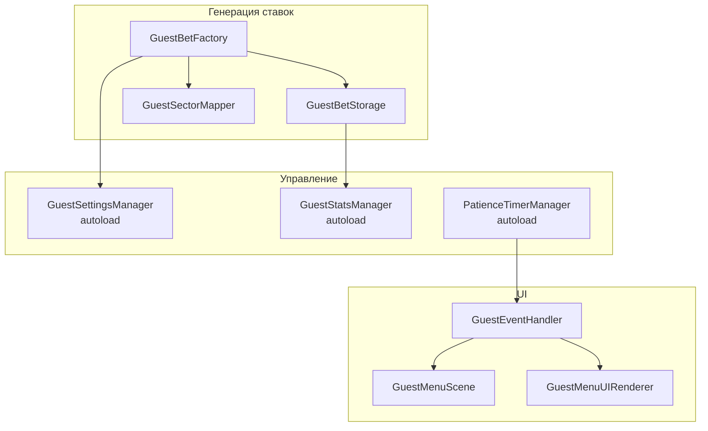

## 🎲 Карты шанса

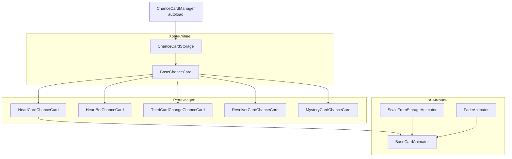

## 📷 Камера и навигация

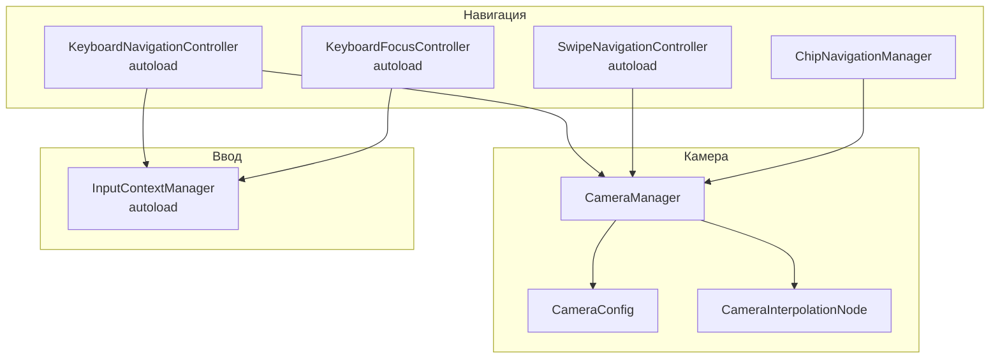

## 💎 Система фишек

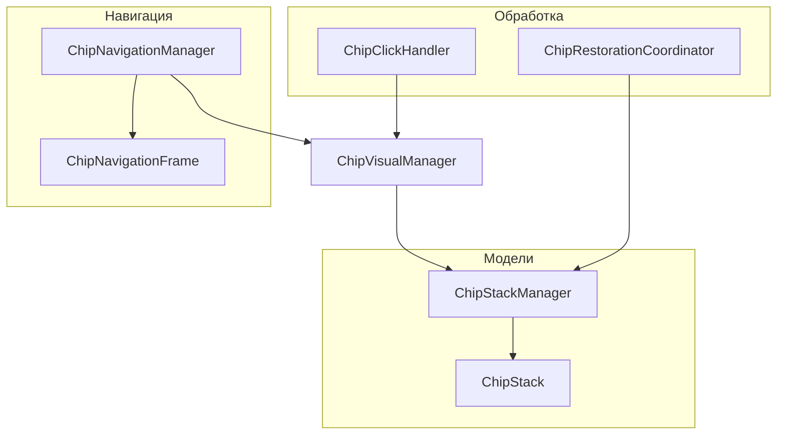

## 🎯 Система ставок

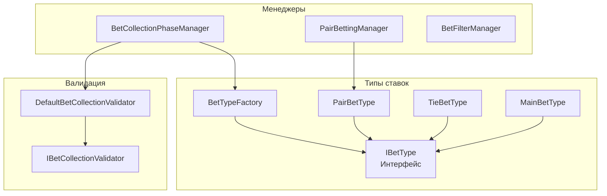

## 🔗 Autoload синглтоны (23 штуки)

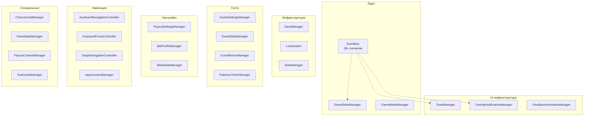

## ⚠️ Критические зависимости

### EventBus - центральная точка связи

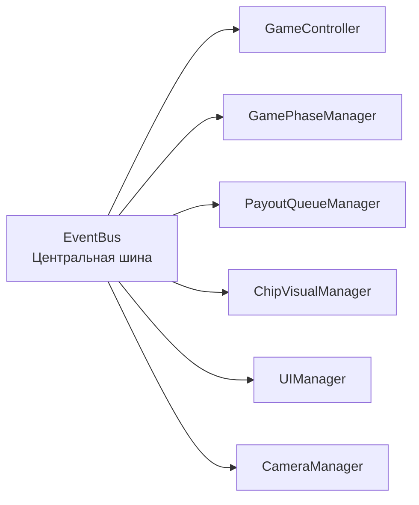

**Важно**: Все менеджеры общаются через EventBus, НЕ напрямую!

## 🔄 Циклы зависимостей (избегать!)

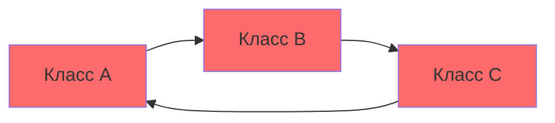

**Решение**: Использовать EventBus для разрыва циклов

## 📈 Метрики зависимостей

| Класс | Количество зависимостей | Уровень сложности |
|-------|------------------------|-------------------|
| GameController | 20+ | 🔴 Высокий |
| GamePhaseManager | 10+ | 🟡 Средний |
| UIManager | 5 | 🟢 Низкий |
| BaccaratRules | 0 | 🟢 Низкий |

## 💡 Рекомендации

1. **Избегайте прямых зависимостей** - используйте EventBus
2. **Следуйте Dependency Inversion Principle** - зависеть от абстракций
3. **Разрывайте циклы** через EventBus или интерфейсы
4. **Минимизируйте зависимости** - чем меньше, тем лучше

---

**Примечание**: Этот граф создан на основе анализа кода. При изменении архитектуры обновите его вручную.

